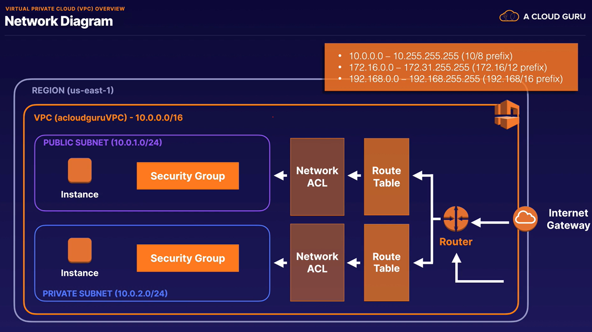

# AWS Notes

## VPC

### Exam Tips

- VPC == logical data center in AWS
- Consists of internet gateways (i.e., virtual private gateways), route tables, network access control lists (NACLs), subnets, and security groups
- 1 subnet is always in 1 availability zone, cannot span multiple availability zones
- NACLs can block specific IP addresses
- Transit Gateway used over VPC Peering if there are too many VPCs to reasonably peer
- Security Groups == stateful; NACLs == stateless (mnemonic: list/less ; groups become full)
- AWS Wavelength == 5G network embedding

### Common IP Ranges

[Website to calculate IP ranges: cidr.xyz](https://cidr.xyz)

Common ranges:

- 10.0.0.0 - 10.255.255.255 (10/8 prefix) (most corporations use this)
- 172.16.0.0 - 172.31.255.255 (172.16/12 prefix)
- 192.168.0.0 - 192.168.255.255 (192.168/16 prefix) (most homes use this)

### Default VPC

- User friendly
- All subnets in default VPC have a route out to the internet
- Each EC2 instance has both a public and private IP address

### NAT Gateway

- NAT == Network Address Translation
- AWS handles scaling

### Network Access Control Lists (NACLs)

- NACLs are stateless, meaning that they do not store any information about the traffic
- Rules are evaluated from low to high and the first rule that matches the traffic is applied
- Default NACL: allow all traffic inbbound and outbound
- Custom NACL: by default, deny all traffic inbound and outbound

### Security Groups

- Can be changed when instance is RUNNING or STOPPED
- Security groups are stateful, meaning that they store information about the traffic

## CloudWatch

### Exam Tips

- DEFAULT METRICS: CPU utilization, network throughput
- EC2 Memory Utilization is NOT A DEFAULT METRIC (common question)
- EBS Storage Capacity is NOT A DEFAULT METRIC (common question
